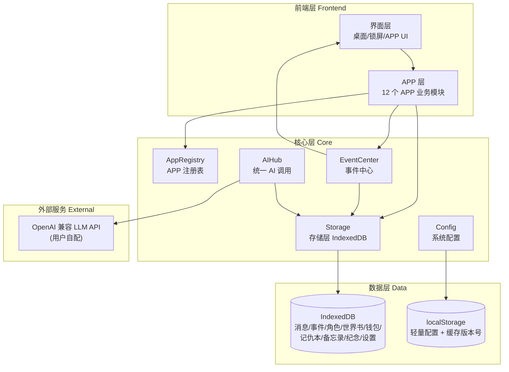

# 小手机系统 技术架构文档

## 1. 架构设计

纯前端静态部署，无后端。所有数据存 IndexedDB（少量配置用 localStorage），AI 调用通过用户配置的 OpenAI 兼容接口直连。模块通过 IIFE + 全局命名空间 `window.Phone` 协作，不使用 ES Module（避免本地双击白屏）。



## 2. 技术说明

- **前端**：原生 HTML5 + CSS3 + JavaScript（ES2020+），**不使用框架/构建工具**。
- **理由**：纯静态托管 InfinityFree，IIFE + 全局对象避免 ES Module 双击白屏问题，零构建即可直接部署。
- **存储**：IndexedDB（主存储，封装在 `Storage` 层）+ localStorage（轻量配置）。
- **AI 接口**：用户自配的 OpenAI 兼容接口（地址 + Key + 模型），fetch + ReadableStream 流式输出。
- **PWA**：`manifest.json` + `service-worker.js`，首次加载后缓存静态资源，断网可开。
- **图标库**：自绘线条风 SVG（stroke-width 1.5px），不依赖第三方图标库。
- **字体**：PingFang SC / HarmonyOS Sans SC（系统字体优先），不引入 Web 字体。

## 3. 目录结构

```
/workspace
├── index.html              # 入口
├── manifest.json           # PWA manifest
├── service-worker.js       # PWA 离线缓存
├── css/
│   ├── theme.css           # 全局主题变量 + 基础组件样式
│   ├── desktop.css         # 桌面/锁屏/启动样式
│   ├── chat.css            # 消息中心样式
│   └── apps.css            # 其他 APP 通用样式
├── js/
│   ├── core/
│   │   ├── storage.js          # 存储层（IndexedDB 封装）
│   │   ├── event-center.js     # 事件中心
│   │   ├── app-registry.js     # APP 注册表
│   │   ├── ai-hub.js           # 全局 AI 调用（请求/接口选择/报错/记忆格式/兜底）
│   │   ├── config.js           # 系统配置（默认值 + 读写 + 主题切换）
│   │   └── utils.js            # 通用工具（DOM/日期/防抖/格式化）
│   ├── desktop/
│   │   ├── boot.js             # 启动动画
│   │   ├── lockscreen.js       # 锁屏密码
│   │   ├── status-bar.js       # 状态胶囊
│   │   ├── widgets.js          # 小组件（时间/天气/今日提示/黑胶唱片）
│   │   ├── app-grid.js         # APP 图标网格
│   │   ├── dock.js             # Dock 栏
│   │   └── desktop.js          # 桌面总装
│   ├── apps/
│   │   ├── chat/
│   │   │   ├── chat.js             # 消息列表
│   │   │   ├── conversation.js     # 聊天界面
│   │   │   ├── chat-settings.js    # 聊天设置
│   │   │   ├── message-renderer.js # 消息渲染
│   │   │   ├── input-bar.js        # 输入工具栏
│   │   │   └── chat-ai.js          # 消息 AI 逻辑说明书（独立文件）
│   │   ├── settings/
│   │   │   ├── settings.js         # 设置主页
│   │   │   ├── personalization.js  # 个性化
│   │   │   ├── ai-config.js        # AI 与接口
│   │   │   ├── notifications.js    # 通知
│   │   │   ├── lock-security.js    # 锁屏与安全
│   │   │   └── data.js             # 数据管理
│   │   ├── moments/moments.js
│   │   ├── gallery/gallery.js
│   │   ├── characters/characters.js
│   │   ├── worldbook/worldbook.js
│   │   ├── wallet/wallet.js
│   │   ├── shop/shop.js
│   │   ├── memo/memo.js
│   │   ├── anniversary/anniversary.js
│   │   ├── games/games.js
│   │   └── music/music.js
│   └── main.js                  # 入口总装：初始化所有模块
└── .trae/documents/
    ├── PRD.md
    └── Tech-Architecture.md
```

## 4. 命名空间设计

```javascript
window.Phone = {
  Storage,        // IndexedDB 封装：get/set/list/delete/onTable
  EventCenter,    // 事件中心：emit/on/off/getEvents/markRead
  AppRegistry,    // APP 注册表：register/get/all/open
  AIHub,          // 全局 AI：stream/quickReply/formatMemory/fallback
  Config,         // 系统配置：get/set/applyTheme/listen
  Utils,          // 通用工具
  Desktop,        // 桌面总装
  Apps: { chat, settings, moments, ... }  // 各 APP 模块
};
```

## 5. 核心数据模型（IndexedDB Stores）

| Store 名 | 主键 | 索引 | 用途 |
|----------|------|------|------|
| `events` | `id` (auto) | `type, appId, createdAt, read` | 事件中心所有事件 |
| `conversations` | `id` | `pinned, hidden, updatedAt` | 消息会话列表 |
| `messages` | `id` (auto) | `conversationId, createdAt` | 聊天消息 |
| `characters` | `id` | `name, active` | AI 角色定义 |
| `memories` | `id` (auto) | `characterId, createdAt` | AI 记忆（按角色隔离） |
| `worldbook` | `id` | `name, active` | 世界书条目 |
| `moments` | `id` (auto) | `createdAt` | 朋友圈时间线 |
| `gallery` | `id` (auto) | `createdAt` | 记仇本条目 |
| `memo` | `id` (auto) | `createdAt, pinned` | 备忘录条目 |
| `anniversary` | `id` | `date` | 纪念日 |
| `wallet_tx` | `id` (auto) | `createdAt, type` | 钱包交易记录 |
| `shop_items` | `id` | `owned` | 商店物品 |
| `notifications` | `id` (auto) | `appId, read, createdAt` | 站内通知 |
| `kv` | `key` | - | 杂项 KV：壁纸、主题、布局、密码等 |

## 6. 核心模块接口定义

### 6.1 Storage（存储层）
```javascript
Phone.Storage = {
  init(),                          // 初始化 IndexedDB
  get(store, key),                 // 读单条
  set(store, value),               // 写单条（带主键）
  put(store, value),               // 覆盖写
  list(store, { index, range, limit, reverse }),  // 列表查询
  delete(store, key),              // 删除
  clear(store),                    // 清空 store
  exportAll(),                     // 导出全部（用于数据导出）
  importAll(json),                 // 导入全部
  onTable(store, callback)         // 监听某 store 变化
};
```

### 6.2 EventCenter（事件中心）
```javascript
Phone.EventCenter = {
  emit({ type, appId, title, body, data }),   // 触发事件 → 写入 events store
  on(type, callback),                         // 订阅事件类型
  off(type, callback),                        // 取消订阅
  getRecent({ limit, appId, unreadOnly }),    // 拉取最近事件（消息中心用）
  markRead(id),                               // 标记已读
  markAllRead(appId),                         // 批量已读
  unreadCount(appId)                          // 未读计数（桌面角标用）
};
```

### 6.3 AppRegistry（APP 注册表）
```javascript
Phone.AppRegistry.register({
  id: 'chat',
  name: '消息',
  icon: '<svg>...</svg>',          // 线条风 SVG
  entry: () => Phone.Apps.chat.open(),
  events: ['message_received', 'message_sent'],   // 会产生的事件类型
  settings: [...],                 // 需要的设置项
  aiSpec: 'js/apps/chat/chat-ai.js',  // AI 说明书文件
  defaultInDock: true
});
```

### 6.4 AIHub（全局 AI 调用）
```javascript
Phone.AIHub = {
  stream({ characterId, messages, onDelta, onDone, onError }),
  // fetch + ReadableStream 逐字回调
  // 内部：选接口（按角色或全局）→ 拼 system prompt（含角色卡+世界书+最近事件）→ 流式输出
  quickReply({ characterId, userText }),  // 非流式快捷回复
  formatMemory(role, content),           // 通用记忆格式
  fallback(reason)                       // 兜底回复文案
};
```

### 6.5 Config（系统配置）
```javascript
Phone.Config = {
  defaults: {
    systemName: '小手机',
    theme: 'lavender',
    wallpaper: 'gradient:lavender',  // 默认薰衣草淡紫渐变
    lockPassword: '0326',
    lockWallpaper, lockAvatar, lockText,
    dockApps: ['chat', 'settings', 'characters', 'worldbook'],
    desktopLayout: { cols: 4, gap: 16 },
    api: { baseURL, apiKey, model },
    fontSize: 'base',
    bubbleStyle: 'rounded',
    ...
  },
  get(key),                  // 读取单值（带默认值回退）
  set(key, value),           // 写入 kv store + 触发监听
  applyTheme(name),          // 切换主题 → 改 <html data-theme>
  listen(key, callback)
};
```

## 7. 主题与 CSS 变量

`<html data-theme="lavender|pink|honey|sky">` 切换。`css/theme.css` 定义全部变量：

```css
[data-theme="lavender"] {
  --bg-base: #f6f3fb;
  --bg-surface: #ffffff;
  --bg-hover: #efeaf8;
  --color-primary: #9b8fD8;
  --color-primary-light: #c9c0ee;
  --color-primary-ultralight: #ece6fa;
  --color-primary-deep: #7c6fc4;
  --color-accent: #f7b8c8;
  --color-accent-light: #fbd4dd;
  --text-primary: #4a4458;
  --text-secondary: #8a8499;
  --text-placeholder: #b6b0c6;
  --shadow-soft: 0 4px 16px rgba(155, 143, 216, 0.12);
  --shadow-card: 0 8px 28px rgba(155, 143, 216, 0.16);
  --shadow-float: 0 12px 40px rgba(155, 143, 216, 0.22);
  --shadow-neu-out: 6px 6px 12px rgba(155,143,216,0.18), -6px -6px 12px rgba(255,255,255,0.9);
  --shadow-neu-in: inset 4px 4px 8px rgba(155,143,216,0.18), inset -4px -4px 8px rgba(255,255,255,0.9);
  --radius-sm: 10px; --radius-md: 16px; --radius-lg: 20px; --radius-xl: 28px; --radius-full: 999px;
}
```

## 8. AI 流式输出实现要点

```javascript
async function streamChat({ baseURL, apiKey, model, messages, onDelta }) {
  const res = await fetch(`${baseURL}/chat/completions`, {
    method: 'POST',
    headers: { 'Content-Type': 'application/json', 'Authorization': `Bearer ${apiKey}` },
    body: JSON.stringify({ model, messages, stream: true })
  });
  const reader = res.body.getReader();
  const decoder = new TextDecoder();
  let buffer = '';
  while (true) {
    const { done, value } = await reader.read();
    if (done) break;
    buffer += decoder.decode(value, { stream: true });
    const lines = buffer.split('\n');
    buffer = lines.pop();
    for (const line of lines) {
      if (!line.startsWith('data: ')) continue;
      const data = line.slice(6);
      if (data === '[DONE]') return;
      const json = JSON.parse(data);
      const delta = json.choices?.[0]?.delta?.content || '';
      if (delta) onDelta(delta);
    }
  }
}
```

## 9. 软键盘与防抖

- 软键盘：`window.visualViewport.addEventListener('resize', ...)`，输入框 focus 时 `scrollIntoView({ block: 'center' })`。
- 防抖提交：发送时 `button.disabled = true`，回复完成（或报错）后置 `false`。
- 长对话性能：消息列表只渲染最近 50 条 + 滚动到顶加载更早。

## 10. PWA 配置

`manifest.json`：
- `name`: "小手机"
- `display`: `standalone`
- `theme_color` / `background_color`: 薰衣草淡紫
- `icons`: 192/512 PNG（线条风 logo）

`service-worker.js`：
- `install`: 预缓存核心文件
- `fetch`: 缓存优先，回退网络
- `activate`: 清旧版本缓存
- 版本号通过 SW 内常量控制，更新时改版本号

## 11. 开发顺序（15 棒）

1. **底座层**：theme.css + storage.js + event-center.js + app-registry.js + config.js + utils.js + ai-hub.js
2. **启动层**：boot.js + lockscreen.js + status-bar.js
3. **桌面组件**：widgets.js + app-grid.js + dock.js
4. **桌面总装**：desktop.js + index.html
5. **消息中心**：chat.js + conversation.js + chat-settings.js + message-renderer.js + input-bar.js + chat-ai.js
6. **设置中心**：settings.js + personalization.js + ai-config.js + notifications.js + lock-security.js + data.js
7. **其他 APP**：角色/世界书/记仇本/钱包/商店/备忘录/周年纪念/游戏/音乐/朋友圈
8. **PWA**：manifest.json + service-worker.js
9. **测试**：按测试规则找问题

## 12. 文件大小约束

- 单文件不超过 800 行
- 业务/界面/样式/数据/AI 逻辑分开
- 每个 APP 的 AI 逻辑说明书独立文件（如 `chat-ai.js`）

## 13. 安全与隐私

- API Key 仅存本地 IndexedDB（kv store），不上传任何第三方
- 数据导出由用户主动触发
- 无后端，不存在服务端泄露风险
